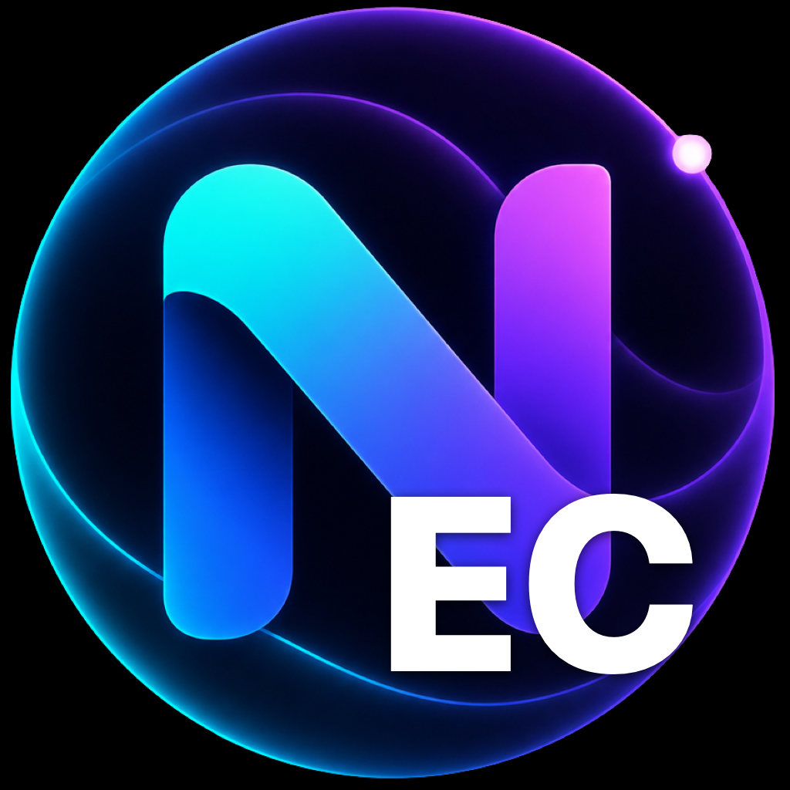
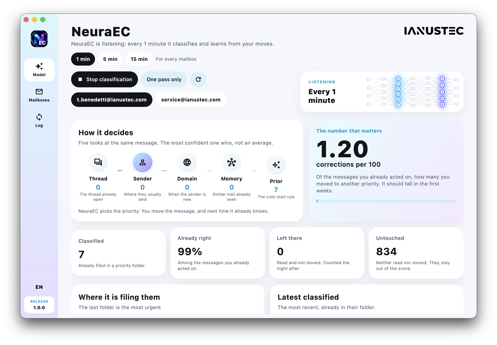

<p align="center">
  
</p>

<h1 align="center">NeuraEC</h1>

<h3 align="center">Stop reading email in the order it arrived.<br>Read it in the order it matters.</h3>

<p align="center">
  <strong>A neural email classifier built by <a href="https://www.ianustec.com">IANUSTEC</a>.<br>It lives on your PC, and it learns from you. Only from you.</strong>
</p>

<p align="center">
  <a href="LICENSE"></a>
  
  
</p>

<p align="center">
  
  
  
  
  
  
</p>

<p align="center">
  
</p>

---

## 200 unread. One of them matters.

It is the client who writes once a year. The supplier whose "small issue" became a contract problem overnight. The colleague who needed an answer before lunch.

It is somewhere under forty newsletters, twelve notifications and a CC you should never have been on.

**Rules can't find it.** Rules know the senders you already told them about.
**Cloud AI can't be trusted with it.** To sort your mail, it has to read your mail on someone else's server.

**NeuraEC finds it. On your machine.**

---

## What it feels like

You open your mailbox and it is already sorted.

`Neura-P4` — answer now.
`Neura-P3` — today.
`Neura-P2` — this week.
`Neura-P1` — when you have a minute.

Disagree? **Drag the message somewhere else.** That's the whole training interface. On the next pass — every 1, 5 or 15 minutes, your choice — NeuraEC has learned it. The next message from that person lands where you put the last one.

No prompts. No rules editor. No labelling sessions. You just use your email, and it gets better at *your* email.

---

## Your screen stays quiet

NeuraEC files every unread message. It **pings you only for the priorities you turn on.**

`Neura-P4` on, the rest off: a newsletter can land in `Neura-P1` and your desktop never hears about it. The client in `Neura-P4` does. One message, and the alert carries the subject. Several at once, and you get a count per folder, not a stack of popups.

Each mailbox has its own switches. Turn the whole thing off and classification keeps running in silence. The alerts arrive while NeuraEC is open, or sitting in the menu bar.

---

## The NEURA engine

NeuraEC runs **NEURA**, the classification engine designed and built by IANUSTEC in Italy. It is not a chatbot wrapped around your inbox. It is a purpose-built ranking network for one job: deciding how urgent a message is *for you*.

Every unread message goes through five specialists at once:

<table>
<tr><td>🧵 <strong>Thread</strong></td><td>This conversation already has a priority. Replies inherit it.</td></tr>
<tr><td>👤 <strong>Sender</strong></td><td>This person usually lands here, and it knows how sure to be.</td></tr>
<tr><td>🏢 <strong>Domain</strong></td><td>This company usually lands here.</td></tr>
<tr><td>🧠 <strong>Memory</strong></td><td>This message <em>means</em> the same thing as ones you already sorted, even with different words, even in another language.</td></tr>
<tr><td>✨ <strong>Prior</strong></td><td>Day one, before you have taught it anything: structure, recipients, tone.</td></tr>
</table>

Each specialist votes with a full distribution over your priority levels and a confidence it has to **earn**. NEURA blends them into one rank. A sender you corrected twice outweighs a sender seen once. The cold-start prior carries the first days, then steps aside as your own evidence takes over.

And it keeps learning:

| You… | NEURA learns | Weight |
| --- | --- | --- |
| **move** a message to another priority | "I was wrong. Here is where it goes." | **1.0** |
| **reply** | "This one mattered." | **0.5** |
| **read it and leave it** | "Fair enough." (the night after, once) | **0.2** |
| **ignore it** | nothing — it never guesses you agreed | 0 |

Old habits fade with a 90-day half-life, so the model follows you when your work changes. Quiet confirmations are capped per sender, so a newsletter you tolerate can never outvote the client you moved.

**One model per mailbox.** No shared gradient. No other company's inbox training yours.

---

## Private by architecture, not by promise

| | **NeuraEC** | Cloud AI inbox tools | Rules and filters |
| --- | :---: | :---: | :---: |
| Where your mail is analysed | **Your PC** | Their servers | Your provider |
| Learns from your corrections | **Yes, in minutes** | Sometimes | No |
| Handles senders it has never seen | **Yes** | Yes | No |
| Your data trains other customers' models | **Never** | Read the terms | — |
| Works across languages | **Yes** | Yes | No |
| Desktop alert | **Only the priorities you pick** | All of them, or none | No |
| Price | **Free, open source** | Subscription | Free |

Your mail stays at your provider. NeuraEC connects to it the way your email client does. IANUSTEC never receives a message, a subject line, or a password. The password is never written into a config file.

---

## Folders or labels. Your call.

| Provider | NeuraEC |
| --- | --- |
| **Gmail** | Labels the message and leaves it in your inbox, or moves it. |
| **Microsoft 365 / Outlook** | Labels the message and leaves it in your inbox, or moves it. |
| **Any IMAP** (Aruba, Libero, company servers…) | Moves it into the priority folder. |

Choose how many levels you want and which end is urgent. NeuraEC checks what your provider supports and adapts.

---

## Roadmap

NEURA already ranks your mail with five specialists and learns from every move. Next, it gets neural all the way down.

- [x] **NEURA engine** — five specialists, earned confidence, learning from moves, replies and silence
- [x] **IMAP, Gmail, Microsoft 365** — folders or labels, whatever your provider supports
- [x] **Desktop app** — macOS, Windows and Linux, released together. On Mac it is signed and notarized and lives in the menu bar
- [x] **Alerts for the priorities you choose** — one switch per folder, per mailbox. The rest is classified in silence
- [ ] **NEURA Prior Network** — IANUSTEC's own neural network for the first days, before you have taught NeuraEC anything. A 401 → 128 → 32 → 1 network, already trained by IANUSTEC on 1,344 real messages from 13 people, weights already in this repository. It switches on when it beats the current rules **for every single user** on the benchmark, not just on average. Today it wins overall and loses on two users, so it waits. We don't lower the bar.
- [ ] **Your personal neural head** — once your mailbox has taught NEURA enough, a small neural network trained **only on your corrections, only on your PC**, takes over from the generic prior. Your model, literally.
- [ ] **Sort into your own folders** — not just by priority: straight into the folders you already have. One per client, one per project. Pre-trained from years of mail you already filed, so it starts warm on day one.

---

## Want it running 24/7?

NeuraEC is an app on your PC: when the PC sleeps, so does NeuraEC.

If your mailbox has to be classified around the clock, or you want one engine for the whole company, that's **[NEURA Rack](https://www.ianustec.com/neura)** — the same NEURA engine, on a dedicated appliance in your office, by IANUSTEC.

---

## Download

Work happens on the [`dev`](https://github.com/ianustec/NeuraEC/tree/dev) branch. A release is a merge into [`main`](https://github.com/ianustec/NeuraEC/tree/main). That merge builds three downloads and publishes them on [Releases](https://github.com/ianustec/NeuraEC/releases):

- **macOS** — `NeuraEC.dmg` (Apple Silicon)
- **Windows** — `NeuraEC-Windows.zip`
- **Linux** — `NeuraEC-Linux.tar.gz`

Each one contains the window and the engine. No Python to install.

## Get started

On Mac, a signed and notarized `.dmg` built on the IANUSTEC machine opens without a warning. The copy published from GitHub is built in the open: until Apple notarization secrets are added to the repository, Gatekeeper asks you to allow it. Build the signed one locally with `app/tool/build_mac.sh`.

**From source** (Python 3.11+ and Flutter):

```bash
git clone https://github.com/ianustec/NeuraEC
cd NeuraEC/engine
python3 -m venv .venv && source .venv/bin/activate
pip install -e ".[encoder,gmail,graph,dev]"

cd ../app
flutter run -d macos        # or: windows, linux
```

Add your mailbox, press **Avvia addestramento**, then **Avvia classificazione**. That's it.

<details>
<summary><strong>For developers</strong></summary>

<br>

```
NeuraEC/
├─ app/       the window — Flutter, macOS / Windows / Linux
└─ engine/    the NEURA engine — Python package neuraec
```

- The engine runs on its own: `neuraec --help`.
- Without a frozen engine inside the app, the window uses `../engine/.venv`. `NEURA_PYTHON` and `NEURA_PROJECT` override it.
- Mailboxes, registry and weights live in `~/.neura`, never in the repository.
- Tests: `cd engine && pytest`.
- Mac signing and notarization: [`app/README.md`](app/README.md).

</details>

---

## Built on

NEURA reads text through [paraphrase-multilingual-MiniLM-L12-v2](https://huggingface.co/sentence-transformers/paraphrase-multilingual-MiniLM-L12-v2) (Apache 2.0), a frozen multilingual sentence encoder. Everything that decides the rank — the five specialists, the blending, the online learning, the NEURA Prior Network — is NEURA, by IANUSTEC.

## License

Apache License 2.0 © 2026 [IANUSTEC s.r.l.](https://www.ianustec.com) — use it, fork it, ship it.

<p align="center">
  <br>
  <strong>If NeuraEC found the email that mattered, give it a ⭐</strong><br>
  <sub>Designed and built in Italy by IANUSTEC 🇮🇹</sub>
</p>
